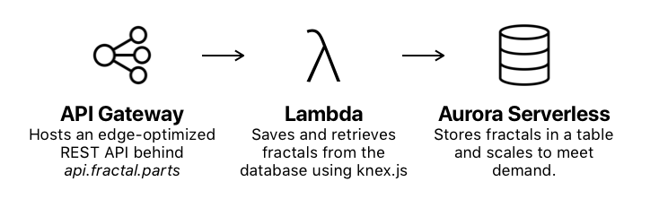

# Backend

## API

| Method | Path            | Request Parameters        | Request Body | Response Body      |
| ------ | --------------- | ------------------------- | ------------ | -------------------|
| GET    | /fractals       | `sort`, `limit`, `offset` | *None*       | `{ total, items }` |
| POST   | /fractals       | *None*                    | `Fractal`    | `Fractal`          |
| GET    | /fractals/{key} | *None*                    | *None*       | `Fractal`          |

See `fractal.schema.json` for the definition of `Fractal`.

## Development

Run the endpoint locally with `npm run start`, deploy to production with `npm
run deploy`. Use knex to migrate (`npx knex migrate:latest`). Run tests with
`npm test`.
